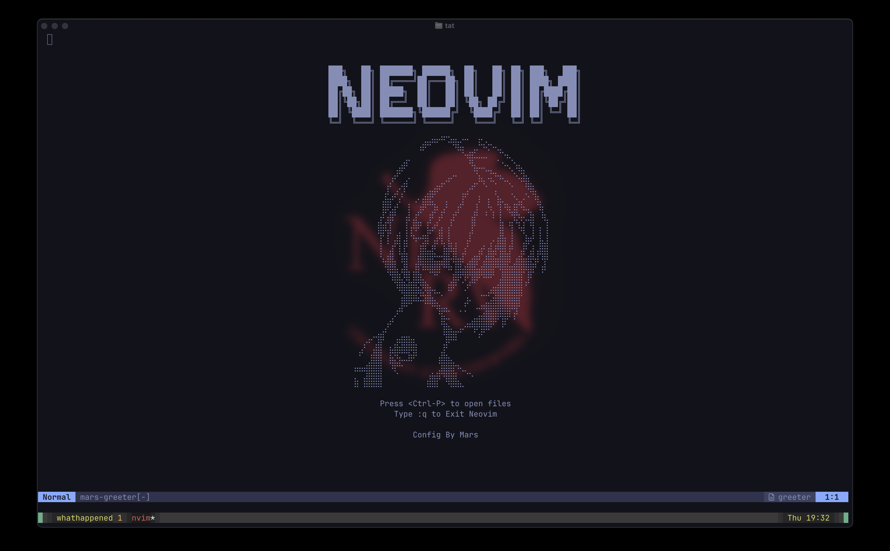

# ☄️ LyQing.nvim 参考 [Mars.nvim](https://github.com/MarsWang42/mars.nvim)

[English](README.md) | [中文](README_zh.md)

个人 Neovim 和 tmux 配置，专注于现代开发体验、AI 辅助编程和生产力。
基于 [Kickstart.nvim](https://github.com/nvim-lua/kickstart.nvim)。



## 📦 安装

### 前置要求

- **Neovim** ≥ 0.10（推荐 0.11+）
- **Git**
- **Nerd Font**（用于图标显示）
- **Node.js**（用于 LSP 服务器）
- **ripgrep**（用于 telescope 搜索）

### 快速安装

```bash
git clone https://github.com/LyQing63/lyqing.nvim.git ~/.config/mars.nvim
cd ~/.config/mars.nvim
chmod +x install.sh
./install.sh
```

安装脚本会：
- 在 `~/.config/nvim` 和 `~/.config/tmux` 创建符号链接
- 自动备份现有配置（带时间戳）

---

## ✨ 功能键位

请参考文档[Keymaps](./keymaps.md)。

## 📁 目录结构

```
.
├── install.sh          # 安装脚本
├── nvim/
│   ├── init.lua        # 入口文件
│   └── lua/mars/
│       ├── options.lua     # Vim 选项
│       ├── keymaps.lua     # 全局快捷键
│       └── plugins/        # 插件配置
│           ├── lsp.lua
│           ├── telescope.lua
│           ├── gitsigns.lua
│           └── ...
└── tmux/
    └── tmux.conf       # Tmux 配置
```

---

## 📝 许可证

MIT
